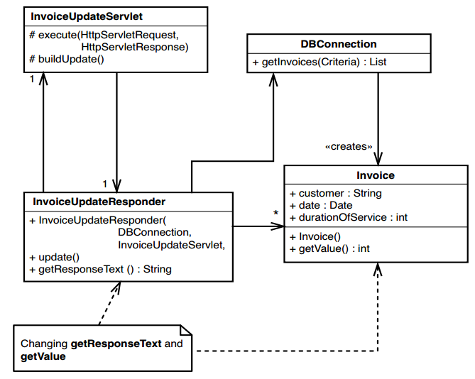
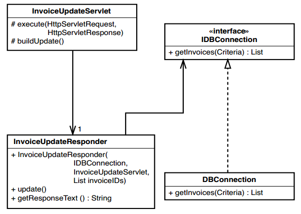

% Intro Refactoring

\newpage{}

# We all have good intentions


Source: http://kfaday.blogspot.com/2016/01/la-vida-de-un-ingeniero-de-sistemas.html

But...


# What is legacy code?


* "Others" code?
* Code difficult to understand?
* Difficult code to maintain?
* ...

> Legacy code is code without tests.

> Code without testing is bad code. It doesn't matter how well written it is; no matter how pretty it is either object-oriented or well encapsulated. With testing, we can change the behavior of our code quickly and verifiably. Without them, we don't know if our code is getting better or worse.

> (2004) M. Feather


# Reasons to change a software

1. Add a feature
2. Fix a bug
3. Improve the design
4. Optimize the use of resources


* Behavior is the most important thing in the software. It's what users depend on.
Users like it when we add features (as long as it is what they wanted), but if we change or remove the behavior they depend on (we introduce bugs), they stop trusting us.

* The act of improving the design without changing its behavior is called refactoring.

* Refactoring is focused on the structure of the program.

* Optimization focuses on the use of resources.

|                | Adding a Feature | Fixing a Bug | Refactoring | Optimizing |
|----------------|------------------|--------------|-------------|------------|
| Structure      | Changes          | Changes      | Changes     | -          |
| Functionality  | Changes          | Changes      | -           | -          |
| Resource Usage | -                | -            | -           | Changes    |

Preserving existing behavior is one of the biggest challenges in software development. Even when we are changing the basic characteristics, we often have very large areas of behavior that we must preserve.

# Risks of change

1. What changes do we have to make?
2. How will we know that the changes were made correctly?
3. How will we know that we have not broken anything?

# Edit and Guess

Industry-standard?

# Cover and Modify

*Tests*

When we have tests that detect changes, it is like having a vision of our code. Code behavior is fixed in place. When we make changes, we can know that we are changing only one part of the behavior at a time. In short, we are in control of our work.

# Many dependencies?



Dependencies are one of the most critical problems in software development. Much of the work with legacy code involves breaking dependencies to make the switch easier.

# The legacy code dilemma

When we change the code, we should have tests in place. For testing, we often have to change the code.

# Breaking dependencies


When you break dependencies in legacy code, you often have to suspend your sense of aesthetics a bit. Some dependencies break cleanly; Others end up looking less ideal from a design point of view. They are like incision points in surgery - a scar may be left on your code after your work, but everything underneath may improve.

# The algorithm for changing legacy code

1. Identify points of change.
2. Find test points.
3. Break dependencies.
4. Write tests.
5. Make changes and refactor.

# Tools

* IDEs
* Unit Test Frameworks

# Techniques

# I don't have much time, and I need to change the code

* It happens somewhere every day *
Your boss walks in and says, "Customers want a new feature. Can we do it today?

"I do not know."

You look around you. Is there testing in place? No.

We ask, "How badly do they need it?"

We know that we can make changes to a few lines in 10 places, and it would be until 5:00 p.m.
Is it an emergency?
Can it be fixed tomorrow?
The code is our house, and we have to live in it.

# Sprout method

```java
public class TransactionGate {
  public void postEntries(List entries) {
    for (Iterator it = entries.iterator(); it.hasNext(); ) {
      Entry entry = (Entry)it.next();
      entry.postDate();
    }
    transactionBundle.getListManager().add(entries);
  }
  //...
}
```

Let's add a feature: Verify new entries are not previously in `transactionBundle`

It could be implemented "easily" with:

```java
public class TransactionGate {
  public void postEntries(List entries) {
    List entriesToAdd = new LinkedList();
    for (Iterator it = entries.iterator(); it.hasNext(); ) {
      Entry entry = (Entry)it.next();
      if (!transactionBundle.getListManager().hasEntry(entry) {
        entry.postDate();
        entriesToAdd.add(entry);
      }
    }
    transactionBundle.getListManager().add(entriesToAdd);
  }
  //...
}
```

But... we fall back into the legacy code loop. Let's now try the Sprout method.

Let's extract the logic to the method.

```java
public class TransactionGate {
//...
  List uniqueEntries(List entries) {
    List result = new ArrayList();
    for (Iterator it = entries.iterator(); it.hasNext(); ) {
      Entry entry = (Entry)it.next();
      if (!transactionBundle.getListManager().hasEntry(entry) {
          result.add(entry);
      }
    }
    return result;
  }
//...
}
```

# Built-in functionality

```java
public class TransactionGate{
//...
  public void postEntries(List entries) {
    List entriesToAdd = uniqueEntries(entries);
    for (Iterator it = entriesToAdd.iterator(); it.hasNext(); ) {
      Entry entry = (Entry)it.next();
      entry.postDate();
    }
    transactionBundle.getListManager().add(entriesToAdd);
  }
//...
}
```

# Implementing the sprout method
1. Identify
2. Add the reference in the code
3. Inputs and outputs as arguments
4. Identify return values
5. Implementation of the method via TDD
6. Delete comment and enable the call.


# Advantages of the sprout method
* Clear separation between the old code and the new one.
* The affected variables can be identified.
* The new method includes tests.

# Disadvantages of the sprout method
* You can leave the original method in a weird state (invocations to external functions).
* You can leave the code in limbo (The new method may not be associated with the responsibility of the original code)

# Sprout class

```cpp
std::string QuarterlyReportGenerator::generate() {
  std::vector<Result> results = database.queryResults(
  beginDate, endDate);
  std::string pageText;
  pageText += "<html><head><title>"
    "Quarterly Report"
    "</title></head><body><table>";
  if (results.size() != 0) {
    for (std::vector<Result>::iterator it = results.begin();it != results.end();++it) {
      pageText += "<tr>";
      pageText += "<td>" + it->department + "</td>";
      pageText += "<td>" + it->manager + "</td>";
      char buffer [128];
      sprintf(buffer, "<td>$%d</td>", it->netProfit / 100);
      pageText += std::string(buffer);
      sprintf(buffer, "<td>$%d</td>", it->operatingExpense / 100);
      pageText += std::string(buffer);
      pageText += "</tr>";
    }
  } else {
    pageText += "No results for this period";
  }
  pageText += "</table>";
  pageText += "</body>";
  pageText += "</html>";
  return pageText;
}
```

Let's add add a feature: Add a header to the type list

```html
<tr><td>Department</td><td>Manager</td><td>Profit</td><td>Expenses</td></tr>
```

Let's extract the logic to class

```cpp
using namespace std;
class QuarterlyReportTableHeaderProducer{
  public:
    string makeHeader();
};

string QuarterlyReportTableProducer::makeHeader(){
  return "<tr><td>Department</td><td>Manager</td>"
  "<td>Profit</td><td>Expenses</td>";
}
```

We add invocation to the original method

```cpp
QuarterlyReportGenerator::generate():
//...
QuarterlyReportTableHeaderProducer producer;
pageText += producer.makeHeader();
//...
```

Are you serious? A method for this

Yes!

It allows additional refactoring

With an interface:

```cpp
class QuarterlyReportTableHeaderGenerator{
  public:
  string generate();
};
```

We can have different implementations:

```cpp
class HTMLGenerator{
  public:
    virtual ~HTMLGenerator() = 0;
    virtual string generate() = 0;
};

class QuarterlyReportTableHeaderGenerator : public HTMLGenerator {
  public:
  //...
    virtual string generate();
  //...
};
class QuarterlyReportGenerator : public HTMLGenerator {
  public:
  //...
    virtual string generate();
  //...
};
```

# Another example, filtering lists

```vb
Public Class ManagerProdFin
{
    Public Sub BuscarAltas(ByVal fechadesde As Date, ByVal fechahasta As Date, ByVal solovigentes As Boolean)
    {
        '...
        Dim listaapoderadosaltas = From apo As Apoderados In ListaApoderados Where
        Convert.ToInt32(apo.aponrocuenta) = Convert.ToInt32(obj.NroCliente)
        AndAlso Not apo.apotipodocumento.Equals("UBO")
        AndAlso (Not solovigentes OrElse
        Not apo.apoFechaVencimiento.HasValue()
        OrElse apo.apoFechaVencimiento.Value.CompareTo(fechahasta) > 0) Select apo
        '...
    }
}
```

# New version

```vb
Public Class ManagerProdFin
{
    Public Sub BuscarAltas(ByVal fechadesde As Date, ByVal fechahasta As Date, ByVal solovigentes As Boolean)
    {
    '...
        Dim listatitularesaltas As List(Of Titulares) = New List(Of Titulares)
        listatitularesaltas = AuxManager.titularesvinculados(obj, ListaTitulares)
    '...
    }
}
```

# The Sprout class

```vb
Public Class ManagerAuxiliar
    Public Sub New()
    End Sub
    Public Function titularesvinculados(ByVal ObjCustomer As Customer_Account,
 ByVal archivotitulares As List(Of Titulares)) As List(Of Titulares)
        Dim archivofiltrado = New List(Of Titulares)
        Dim listafiltrada = From titu As Titulares In archivotitulares
        Where Convert.ToInt32(titu.titubase_no) = ObjCustomer.NroClienteAsInt() Select titu
        For Each T In listafiltrada
            archivofiltrado.Add(T)
        Next
        Return archivofiltrado
    End Function
End Class
```

# And the test

```vb
Imports NUnit.Framework

<TestFixture()>
Public Class ManagerAuxiliarUnitTest
    <Test()>
    Public Sub GivenObjCustandtitulares_WhenTvinculados_ThenArchfiltrado()
        Dim AuxiliaryM As ManagerAuxiliar = New ManagerAuxiliar()
        Dim titularesSet As List(Of Titulares) = New List(Of Titulares)
        titularesSet.Add(New Titulares With {.titubase_no = "0000123"})
        titularesSet.Add(New Titulares With {.titubase_no = "0000124"})
        titularesSet.Add(New Titulares With {.titubase_no = "0000125"})
        Dim Customer As Customer_Account = New Customer_Account()
        Customer.campocustacc = "000124"

        Dim result As List(Of Titulares) = AuxiliaryM.titularesvinculados(Customer, titularesSet)

        Assert.That(result, Has.Count().EqualTo(1))
    End Sub
End Class
```

# Implementing the sprout class

1. Identify where you need to change your code.
2. Can it be grouped in a method? Think of a class name and invoke the method. Comment on the invocation.
3. Variables and arguments.
4. Return values.
5. Develop the sprout class using TDD.
6. Uncomment and invoke.


# Advantages of the sprout class
* Allows you to advance in development with more confidence than if you make invasive changes.

# Disadvantages of the sprout class
* Conceptual complexity.

# Wrap Method

```java
public class Employee{
//...
  public void pay() {
    Money amount = new Money();
    for (Iterator it = timecards.iterator(); it.hasNext(); ) {
      Timecard card = (Timecard)it.next();
      if (payPeriod.contains(date)) {
        amount.add(card.getHours() * payRate);
      }
    }
    payDispatcher.pay(this, date, amount);
  }
}
```

# Add feature

Update a file every time a payment is run to employees

We can add the functionality at the end of the method, but what if ...

```java
public class Employee {
  private void dispatchPayment() { // <1>
    Money amount = new Money();
    for (Iterator it = timecards.iterator(); it.hasNext(); ) {
      Timecard card = (Timecard)it.next();
      if (payPeriod.contains(date)) {
        amount.add(card.getHours() * payRate);
      }
    }
    payDispatcher.pay(this, date, amount);
  }
  public void pay() { // <2>
    logPayment(); // <3>
    dispatchPayment(); // <4>
  }
  private void logPayment() {
    //...
  }
}
```

1. We rename the original method and make it private
2. We create a method that keeps the original signature and takes care of calling the original method and the new functionality

# Another alternative is to keep both functionalities

```java
public class Employee {
  public void makeLoggedPayment() {
    logPayment();
    pay();
  }
  public void pay() {
  //...
  }
  private void logPayment() {
  //...
  }
}
```

# Implementing the wrap method (Option 1)

1. Identify the method you need to change.
2. If the change is to be made as a separate method, rename the method and create a new method with the same name and signature as the previous method.
** It is important to keep the signature **.
3. Invoke the old method from the new method.
4. Develop the new functionality using tests, then call from within the new method.

# Implementing the wrap method (Option 2)

1. Identify the method you need to change.
2. If the change can be formulated as a single sequence of statements in one place, develop a new method using tests.
3. Create another method that calls the new method and the old method.

# Advantages of the wrap method
* Unlike the sprout methods, the original methods do not change. With the sprout technique, at least one line is added.
* The new functionality is independent of the existing functionality.

# Disadvantages of the wrap method

* Difficulty in naming the new methods.

> There are only two hard things in Computer Science: cache invalidation and naming things. - Phil Karlton.

# Wrap Class / Decorator pattern

```java
class LoggingEmployee extends Employee {
  public LoggingEmployee(Employee e) {
    employee = e;
  }
  public void pay() {
    logPayment();
    employee.pay();
  }
  private void logPayment() {
    //...
  }
  //...
}
```

This technique uses the decorator pattern. We create objects of a class that wrap another class and pass them. The class you are wrapping must have the same interface as the class you are wrapping so that clients don't know they are working with a wrapper. In the example, `LoggingEmployee` is a decorator for` Employee`. You must have a `pay ()` method and any other clerk methods that the client uses.

# Wrap Class / Without decorator pattern

```java
class LoggingPayDispatcher {
  private Employee e;
  public LoggingPayDispatcher(Employee e) {
    this.e = e;
  }
  public void pay() {
    employee.pay();
    logPayment();
  }
  private void logPayment() {
    //...
  }
  //...
}
```

The key to the Wrap Class is that new behavior can be added to a system without adding it to an existing class. When there are many calls to the code that you want to wrap, it is often worth moving to a wrapper that uses the decorator pattern.
When you use the decorator pattern, a new behavior can be transparently added to an existing call set, such as `pay()`, all at the same time.

# Implementing the Wrap Class (Option 1)

1. Identify a method where you need to make a change.
2. If the change as a separate method, create a class that accepts the class to be modified as a constructor argument.
3. Create a method in that class, using tests, and implement the new functionality. Write another method that calls the new method and the old method in the Wrap class.
4. Create an instance of the Wrap class in the place where the new functionality needs to be enabled.

# Tips for using the Wrap Class

1. The behavior I want to add is completely independent, and I don't want to ** pollute ** the existing class with low-level or unrelated behavior.
2. The class has grown so much that I really can't bear to make it worse. In a case like this, the wrap is created only as a base for later changes.

# Are there more techniques?

Yes, see catalog of refactorings: https://refactoring.com/catalog/

# Conclusions

* Working with legacy code is difficult
* Tests are necessary
* When the disease cannot be prevented, it has to be treated
* The application of these techniques depends on the context
* The idea of these techniques is to support them with unit tests, without applying test only add more legacy code


# Sources:

** Working Effectively with Legacy Code, 1st. Michael Feathers (2004)

** http://xurxodev.com/trabajando-con-codigo-legado/

** http://xurxodev.com/trabajando-con-codigo-legado-sprout-method-y-sprout-class/

** https://www.yegor256.com/2016/01/26/defensive-programming.html

# About

I help developers to deliver good quality software following the best practices and applying clean code principles - Christian - Husband

* Blog: https://proitcsolution.com.ve
* Twitter: https://twitter.com/JuanMorenoDev[@JuanMorenoDev]
